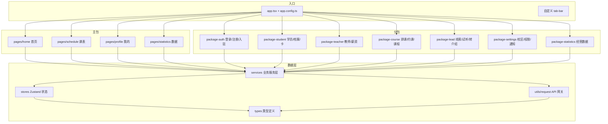

# 前端业务模块地图（快速定位）

> **活跃事实文档**：新增页面 / 分包 / service / store 必须同步更新本图（见文末「登记约束」）。
> 规则正文在 `.harness/rules/`，本图只回答「业务在哪个文件、怎么找」。

## 架构图（mermaid）

## 分包 → 页面 → 服务 映射表

| 分包 | 业务域 | 页面（节选） | 对应 services / stores |
| --- | --- | --- | --- |
| `pages/` 主包 | 首页 / 课表 / 我的 / 概览 | `home`、`schedule`、`profile`、`statistics` | `home`、`schedule`、`my-course`、`my-booking`、`statistics` |
| `package-auth` | 登录注册 / 身份选择 / 入驻引导 / 家长 onboarding | `login`、`register`、`onboarding`、`parent-onboarding`、`identity-select`、`role-switch`、`campus-invite-landing`、`invite-register`、`profile-setup` | `auth*`（auth-login/register/session/shared/profile-map）、`onboarding`、`campus-invite` |
| `package-student` | 学员档案 / 子女管理 / 会员卡 / 转课 | `students`、`student-detail`、`student-form`、`student-transfer`、`children`、`child-detail`、`parent-bind`、`member-card-*`、`renewal-reminder`、`attendance-anomaly`、`follow-record-form` | `student`、`student-parents`、`member-card`、`follow-record`、store: `student` |
| `package-teacher` | 教师档案 / 考勤 / 薪资全流程 | `teacher-list`、`teacher-form`、`teacher-detail`、`staff-invite`、`attendance`、`monthly-flow`、`salary-*`（home/detail/form/payment/settings/template…） | `teacher`、`teacher-monthly-flow`、store: `teacher` |
| `package-course` | 排课 / 约课 / 课程管理 / 卡项 / 补课 | `booking`、`my-course`、`records`、`course-management`、`course-form`、`category-form`、`subject-management`、`schedule-form`、`card-management`、`card-form`、`card-member-list`、`leave-request`、`lesson-*`、`batch-reschedule-*`、`makeup-booking`、`venue-booking`、`booking-rule`、`teacher-booking-config`、`recharge-records`、`package-form` | `booking-config`、`class`、`class-booking`、`course-category`、`course-template`、`schedule`、`card-type`、`leave`、`lesson-record`、`lesson-debt`、`makeup-booking`、`payment`、`recharge`、`venue-booking`、`temporary-reschedule`、stores: `class`/`course-category`/`course-template`/`card-type`/`package-template` |
| `package-lead` | 线索管理 / 试听 / 转介绍 / 代客报名 | `lead-detail`、`lead-form`、`lead-booking-*`、`trial-*`（slots/booking/records）、`trial-slot-config`、`class-slot-config`、`open-slot-edit`、`invite-*`（landing/qrcode）、`my-invite`、`proxy-booking-*` | `lead`、`org-referral`、store: `lead` |
| `package-settings` | 校区 / 角色权限 / 通知 / 系统设置 | `campus-settings`、`campus-detail`、`role-titles`、`permission-settings`、`permission-form`、`notification-send`、`notifications`、`message-auth`、`membership`、`membership-orders`、`audit-log`、`feedback`、`help`、`my-todos`、`todo-settings`、`todo-collaborator`、`threshold-config`、`system-settings`、`theme-settings`、`room-form`、`venue-form`、`venue-list`、`store-entry`、`store-referral-landing` | `campus`、`campus-mapper`、`organization`、`permission`、`notification`、`subscribe-message`、`audit-log`、`feedback`、`todo`、`store-entry`、stores: `campus`/`permission`/`agreement`/`privacy`/`theme`/`subscribe-auth` |
| `package-statistics` | 经营数据 / 卡数据 / 财务 / 预警 | `alert-detail`、`card-data`、`finance-data`、`member-data`、`record-transaction`、`salary-data` | `statistics`、`data-center`、`ops-alerts` |

## 服务层全景（`src/services/`）

| 分组 | 文件 |
| --- | --- |
| 认证 | `auth`、`auth-login`、`auth-register`、`auth-email`、`auth-session`、`auth-shared`、`auth-profile-map` |
| 学员 / 卡 | `student`、`student-parents`、`member-card`、`membership-cache`、`follow-record` |
| 课程 / 排课 | `class`、`class-booking`、`schedule`、`booking-config`、`course-category`、`course-template`、`my-course`、`my-booking`、`temporary-reschedule`、`venue-booking` |
| 课耗 / 补课 | `lesson-record`、`lesson-debt`、`leave`、`makeup-booking` |
| 教师 / 薪资 | `teacher`、`teacher-monthly-flow` |
| 线索 / 转介绍 | `lead`、`org-referral`、`parent-share-invite` |
| 校区 / 权限 | `campus`、`campus-invite`、`campus-mapper`、`organization`、`permission` |
| 通知 / 消息 | `notification`、`subscribe-message`、`ops-alerts` |
| 支付 / 财务 | `payment`、`recharge`、`statistics`、`data-center` |
| 其他 | `audit-log`、`feedback`、`home`、`onboarding`、`store-entry`、`todo`、`upload`、`calendar-sync`、`card-type`(经 course) |

## 状态层全景（`src/stores/`，Zustand）

`campus`（当前校区）、`student`（学员上下文）、`teacher`（教师上下文）、`class`、`course-category`、`course-template`、`card-type`、`package-template`、`lead`、`permission`、`agreement`、`privacy`、`role-glossary`、`theme`、`subscribe-auth`

## 登记约束（新增必须同步，违反即 Review 不通过）

1. **新增页面** → 先查本图所属分包，同域页面进同分包；改 `app.config.ts` 分包注册 + 本图「分包映射表」补一行。
2. **新增 service** → 放入 `src/services/` 并在 `src/services/index.ts` 聚合导出；本图「服务层全景」分组内登记。
3. **新增 store** → `src/stores/` 下新建；本图「状态层全景」登记；禁止新增 store 到非 `stores/` 目录。
4. **改分包边界** → 页面迁移必须同步 `app.config.ts` 与本图；主包只放高频冷启动页（分包铁律）。
5. **mermaid 图与表格冲突时以表格为准**（表格是逐文件核对的事实，图是速览）。

📖 See: `wiki/routing-and-pages.md`（路由/分包详情）、`wiki/component-catalog.md`（组件清单）、`wiki/architecture-boundaries.md`（依赖方向）
