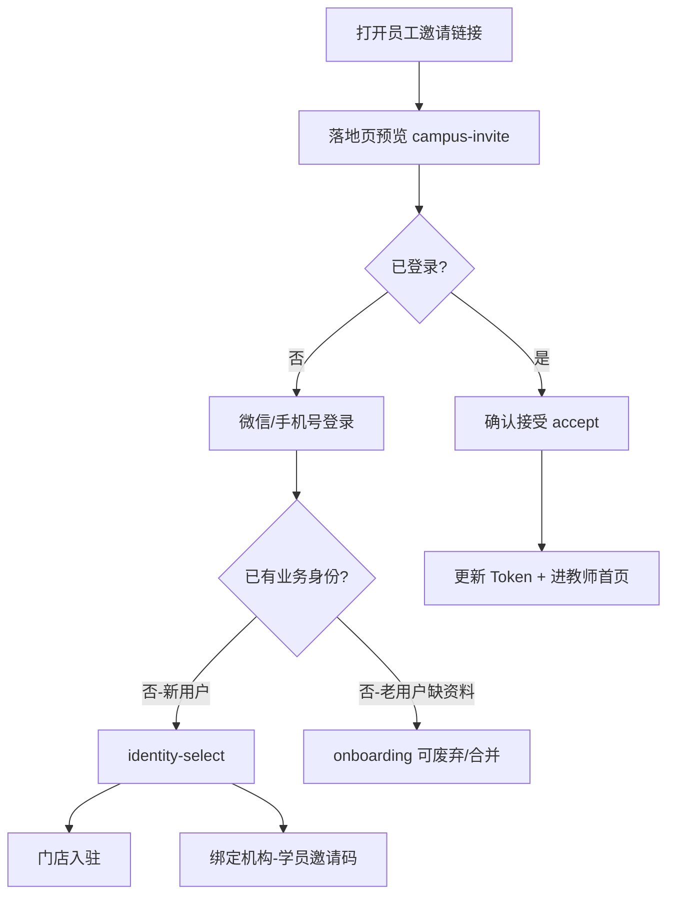

# 前端修复文档：员工邀请绑定 & 登录引导遗留清理

> 日期：2026-08-27  
> 关联：`yunce-backend/docs/diagnostics/2026-08-27-FIX-BACKEND-INVITE-ONBOARDING.md`  
> 状态：**已实施**（2026-08-27）

---

## 1. 问题摘要

| # | 问题 | 严重度 | 根因 |
|---|------|--------|------|
| F1 | 校长无法生成/分享员工邀请码 | **P0** | 无 `campus-invite` Service，无 UI 入口 |
| F2 | 受邀教师无法完成绑定 | **P0** | 无 accept 页面/流程；`verifyCampusCode` 真环境恒 `valid:false` |
| F3 | 注册流程仍可选「我是教师」+ 校区码 | **P0** | `register/role-select`、`role-info` 为旧版三步注册遗留 |
| F4 | `onboarding` 与 `identity-select` 双页并存，文案不一致 | **P1** | 历史迭代未收敛；当前口径应只保留 **identity-select** |
| F5 | 登录默认 `role=PRINCIPAL`，与新用户引导逻辑耦合 | **P2** | `auth.ts` 登录 payload 默认值 |

---

## 2. 目标用户流程（修复后）



**明确不做的事：**

- 注册/登录页不提供「我是教师」选项
- 教师不能输入「校区码」自行加入（`role-info.tsx` 中 `campusCode` 字段删除）
- 不通过 `POST /teachers` 前端表单代建账号代替邀请

---

## 3. 遗留页面判定

| 页面 | 路径 | 判定 | 处置 |
|------|------|------|------|
| **identity-select** | `package-auth/pages/identity-select/index` | ✅ **当前正确** | 保留：门店入驻 + 绑定机构（学员码） |
| **onboarding** | `package-auth/pages/onboarding/index` | ⚠️ 旧版重复 | 删除路由引用；`navigateAfterAuth` 不再跳转；逻辑合并到 identity-select 或 profile 完善 |
| **register/role-select** | 三步注册 Step2 | ❌ 遗留 | 移除教师/校长选项；或整个三步注册仅保留手机号验证（无角色选择） |
| **register/role-info** | 三步注册 Step3 | ❌ 遗留 | 删除教师校区码、机构名字段；家长邀请码迁到 parent-onboarding |
| **invite-landing** | `package-lead/pages/invite-landing` | ⚠️ 线索用 | 与 campus-invite 落地页分离，勿混用 teacherCode |

当前 `auth-onboarding.ts` 中 **新用户 → identity-select** 的分流是正确的；需清理对 onboarding / register 教师路径的引用。

---

## 4. 修复项清单

### 4.1 新增 Service：`src/services/campus-invite.ts`

对接后端（USE_MOCK=false 时走真 API）：

```typescript
// 应对齐 /api/app/v1/campus-invites
listCampusInvites(query)
createCampusInvite({ campusId, roleCode, expireMinutes? })
previewCampusInvite(inviteCode)      // 公开，无需 token
acceptCampusInvite(inviteCode)       // 成功后写 token 到 storage
cancelCampusInvite(id, reason?)
```

Mock 层：`src/data/campus-invite.ts`（可选，与 organization 模块 Mock 风格一致）

### 4.2 校长端：邀请入口 UI

**建议入口（二选一或都要）：**

1. `package-teacher/pages/teacher-list` — 顶部「邀请员工」按钮
2. `package-settings/pages/campus-settings` — 员工管理区块

**交互：**

1. 选择角色：教师 / 校区校长 / 前台（对应 `campus_teacher` / `campus_principal` / `campus_reception`）
2. 选择有效期：30 分钟 / 1 小时 / 1 天 / 7 天
3. 生成后展示邀请码 +「复制链接」+「分享到微信」
4. 列表展示 PENDING / USED / EXPIRED 状态，支持取消

复用 `utils/invite-parent-link.ts` 的复制模式，新增 `buildCampusInvitePath(inviteCode)`。

### 4.3 受邀端：落地 + 接受页

**新建** `package-auth/pages/campus-invite-landing/index.tsx`（或扩展现有 share 落地页）：

1. 路由参数：`?code=XXXXXXXXXX`
2. 调用 `previewCampusInvite` 展示：机构名、校区名、邀请角色、过期时间
3. 未登录 → 跳登录，登录后回跳（storage 存 pending code）
4. 已登录 → 确认按钮 → `acceptCampusInvite` → 替换 token → `navigateAfterLogin`

**auth-onboarding.ts** 增加：

```typescript
// 携带 campusInviteCode → 跳过 identity-select，直达 accept 流程
hasPendingCampusInviteCode()
consumePendingCampusInviteCode()
```

### 4.4 清理注册遗留

| 文件 | 修改 |
|------|------|
| `register/role-select.tsx` | 移除 `teacher` 选项；或整页废弃改为一键登录 |
| `register/role-info.tsx` | 删除教师 `campusCode`、`verifyCampusCode` 表单项 |
| `services/auth.ts` | `verifyCampusCode` 改为调 `previewCampusInvite` 或删除 |
| `registerStep3` | 不向 backend 传 `campusCode` |
| `app.config.ts` | 注册 campus-invite-landing；评估移除 onboarding |
| `utils/auth-onboarding.ts` | 移除 `needsOnboarding` → onboarding 跳转；统一 identity-select |
| `role-switch/add-role.tsx` | 禁止自助添加 teacher 角色 |

### 4.5 登录 payload

`services/auth.ts` 登录/注册：

- 新用户不传 `role: 'teacher'`
- 默认 role 改为由后端决定或 omit（后端默认 PRINCIPAL 仅作占位，前端不展示角色选择）

---

## 5. 与后端契约对齐

| 前端调用 | 后端路由 | 备注 |
|----------|----------|------|
| 预览 | `GET /campus-invites/code/:code` | 无需 Authorization |
| 接受 | `POST /campus-invites/:code/accept` | 响应含新 token，需覆盖 storage |
| 创建 | `POST /campus-invites` | body: `{ campusId, roleCode, expireMinutes }` |
| 列表 | `GET /campus-invites?status=PENDING` | 需 member:invite 权限 |

**注意区分两种邀请码：**

| 类型 | 字段 | 用途 |
|------|------|------|
| 校区员工邀请 | `CampusInvite.inviteCode` | 教师/前台/校长加入机构 |
| 员工拉新码 | `Teacher.inviteCode` | 家长注册归属到某老师（share context） |
| 学员绑定码 | `Student.inviteCode` | 家长绑定孩子 |

UI 文案必须区分，避免「邀请码」一词混用。

---

## 6. 测试计划（前端）

| # | 场景 | 步骤 | 期望 |
|---|------|------|------|
| T1 | 校长发邀请 | 教师列表 → 邀请 → 选 30 分钟 | 显示码 + 可复制 |
| T2 | 新用户点链接 | 未登录打开 landing | 预览机构信息 → 登录 → 自动 accept |
| T3 | 已登录 accept | 教师账号 accept | 进课表首页，身份为 teacher |
| T4 | 注册无教师选项 | 走注册流程 | 不出现「我是教师」 |
| T5 | 新用户登录 | 无身份 | 仅 identity-select 两选项 |
| T6 | Mock 关闭 | USE_MOCK=false 全流程 | 不 fallback 到 mock |

---

## 7. 变更文件清单（预估）

| 文件 | 变更 |
|------|------|
| `src/services/campus-invite.ts` | 新增 |
| `src/data/campus-invite.ts` | 新增 Mock |
| `package-auth/pages/campus-invite-landing/index.tsx` | 新增 |
| `package-teacher/pages/teacher-list/index.tsx` | 邀请入口 |
| `utils/auth-onboarding.ts` | pending campus invite + 移除 onboarding |
| `utils/invite-parent-link.ts` | 或新建 invite-staff-link.ts |
| `register/role-select.tsx` | 删 teacher |
| `register/role-info.tsx` | 删 campusCode |
| `services/auth.ts` | 清理 verifyCampusCode |
| `app.config.ts` | 路由更新 |

---

## 8. 实施顺序

1. ⏳ 等待/联调后端 accept + preview + token 修复
2. 新增 `campus-invite` Service + landing 页
3. 校长端邀请 UI
4. 清理 register/onboarding 遗留
5. 全链路 `USE_MOCK=false` 回归
