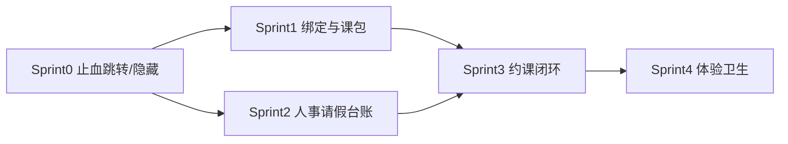

# 教师端 × 家长端 问题汇总与修复计划

> **日期**：2026-08-31  
> **备份**：`_backups/yunceTaro-backup-20260831-060711`  
> **依据**：  
> - 教师：[手工清单](./2026-08-31-teacher-manual-checklist.md) + 代码路径核实  
> - 家长：[PM UX 总结](./2026-08-31-parent-app-pm-ux-summary.md) + 代码路径核实  
> **口径**：以「闭环可用」验收，不以「能打开页」验收；生产禁止 Mock/本地冒充真相源

---

## 一、两端总览

| 维度 | 教师端 | 家长端 |
|------|--------|--------|
| 核实条目 | A10 + B7 + C8 = **25** | P0×5 + P1×5 + P2×5 = **15** |
| 真实性 | 全部 ✅（C6 为文档口径漂移） | 全部 ✅ |
| 主线状态 | 课表/点名/学员可用；台账/待办/人事阻塞 | 绑定→首页→班课请假可用；卡包/约课四态/场地断 |
| 共性病根 | 假数据、错跳守卫页、字段/角色契约缺口、入口多于闭环 | 同左 |

### 共性模式（优先按模式修，避免两端各改一遍）

| 模式 | 教师 | 家长 | 统一策略 |
|------|------|------|----------|
| **假 0 / 假流水** | A1 台账 Mock、A2 四格 0、B2 工资明细 genMock | #6 四格 0、#1/#9 本地假成功 | 未接 API → 空态/隐藏；禁止恒 0 与 genMock |
| **待办/入口错链进管理页** | A3–A7 | #2 卡包错链、#3 场地路径错 | 按角色改落地 URL；管理入口仅 Manager |
| **后端角色缺口** | A8 请假无 PRINCIPAL、A9/A10 schema | #4 POST /students 仅 TEACHER、#5 课包仅 TEACHER、场地无 PARENT | 按产品角色补 requireRole / 只读接口 |
| **入口多于闭环** | B3 营销、B4 考勤名实、B7 notWired | #8 调课文案、#10 占位、#1 私教 | 未就绪隐藏或改文案 |

---

## 二、问题总表（统一编号）

### 教师端

| ID | 原号 | 严重度 | 一句话 | 侧 |
|----|------|--------|--------|-----|
| T-A1 | A1 | P0 | 教学台账生产仍走 buildMockBundle | FE→API |
| T-A2 | A2 | P0 | 「我的」四格硬编码 0 | FE |
| T-A3 | A3 | P0 | 待办薪资 → salary-payment 无权限 | FE |
| T-A4 | A4 | P0 | 待办预警 → alert-detail 无权限 | FE |
| T-A5 | A5 | P0 | 补点名缺 scheduleId → 课程管理无权限 | FE |
| T-A6 | A6 | P0 | 添加学员后「立即分班」进课程管理无权限 | FE |
| T-A7 | A7 | P0 | 点名页「编辑」进 course-form 无权限 | FE |
| T-A8 | A8 | P0 | 校长请假审批 403（无 PRINCIPAL） | BE+FE |
| T-A9 | A9 | P0 | 员工删除/恢复用 update(status) 无效 | BE+FE |
| T-A10 | A10 | P0 | 教师表单扩展字段静默丢失 | BE 或 FE 裁剪 |
| T-B1 | B1 | P1 | 台账「我的预约」Tab redirect 跳走 | FE |
| T-B2 | B2 | P1 | 工资明细 genMock | FE |
| T-B3 | B3 | P1 | 营销四入口开发中 | FE |
| T-B4 | B4 | P1 | 考勤入口名实不符 | FE |
| T-B5 | B5 | P1 | 教师难进正式工资单 | FE |
| T-B6 | B6 | P1 | 上课记录 N+1 拉取 | FE+BE |
| T-B7 | B7 | P1 | 发薪周边 notWired | FE 藏或 BE 实 |
| T-C1–C8 | C* | P2 | 首屏重叠、充值不下钻、无权限文案、家长页可进、幽灵页、主题口径、关于入驻、staff-invite 死页 | FE/Docs |

### 家长端

| ID | 原号 | 严重度 | 一句话 | 侧 |
|----|------|--------|--------|-----|
| P-01 | #1 | P0 | 私教约/我的课程四态仅本地；团课双写易漂移 | FE+BE |
| P-02 | #2 | P0 | 「我的卡包」跳到 my-course | FE |
| P-03 | #3 | P0 | 场地 FE `/venue-booking` ≠ BE `/venues`；PARENT 无创建权 | FE 藏或契约 |
| P-04 | #4 | P0 | 绑定死路：Sheet/bind mock、添加子女 403、自造码 | FE+BE |
| P-05 | #5 | P0 | 成长档案点不进详情；课包 PARENT 403 | FE+BE |
| P-06 | #6 | P1 | 「我的」四格恒 0 | FE |
| P-07 | #7 | P1 | 上课记录默认只看第一个孩子 | FE |
| P-08 | #8 | P1 | 「请假调课」生产只能请假 | FE 文案 |
| P-09 | #9 | P1 | 待评价假成功、状态改回 booked | FE |
| P-10 | #10 | P1 | 排行榜/积分/帮助空壳 | FE |
| P-11–15 | #11–15 | P2 | 绑定入口冗余、身份切换打不开、失败文案弱、门店入驻误导、Staff 深链 | FE |

---

## 三、修复原则（验收口径）

1. **角色落地正确**：教师待办/引导不得进 Manager 页；家长不得进 Staff 写页。  
2. **无能力不露入口**：未接线、仅 Mock、仅本地 → 隐藏或「即将上线」，禁止 Toast 成功。  
3. **生产无假数**：统计/台账/明细要么真实，要么空态/隐藏。  
4. **一种主路径**：家长加孩子 = 机构学员邀请码绑定；教师工资自查 = monthly-flow / salary-detail。  
5. **失败可行动**：无权限文案区分「需校长 / 未对当前角色开放 / 请用邀请码绑定」。

---

## 四、分批计划

### Sprint 0 — 立刻止血（建议 0.5～1 天，纯前端）

目标：消灭「点进去无权限 / 错链 / 假反馈」，不依赖后端发版。

| 序号 | ID | 动作 | 关键文件（预期） |
|------|-----|------|------------------|
| 0.1 | T-A3 | 薪资待办 → `monthly-flow?tab=salary` | `services/todo.ts` |
| 0.2 | T-A4 | 经营预警：教师不下发 alert-detail；续费保留学员待办 | `services/todo.ts` |
| 0.3 | T-A5 | 无 scheduleId → 课表今日；禁止 course-management | `services/todo.ts` |
| 0.4 | T-A6 | 教师「立即分班」改课表/学员详情；或仅校长显示 | `useStudentForm.ts` |
| 0.5 | T-A7 | 教师隐藏点名「编辑」 | `lesson-form/index.tsx` |
| 0.6 | T-B3 | 教师隐藏营销整区 | `profile/index.tsx` |
| 0.7 | T-B1 | 删预约 Tab 或内嵌；停 redirect | `monthly-flow/index.tsx` |
| 0.8 | P-02 | 卡包 → `child-detail?tab=packages`（多孩选孩） | `profile/index.tsx` |
| 0.9 | P-03 | 家长隐藏场地入口（产品默认：暂不开放） | 课表场地卡 / KingKong |
| 0.10 | P-01 半 | 家长隐藏私教自约 / 灰显 | `TrialBookingView` / schedule |
| 0.11 | P-06 + T-A2 | 两端四格：隐藏或「开通中」 | `profile/index.tsx` |
| 0.12 | P-08 | 金刚文案「请假」 | `home-ui.ts` + leave 页标题 |
| 0.13 | P-09 | 隐藏「去评价」 | `my-course/index.tsx` |
| 0.14 | P-10 | 隐藏排行榜/积分 | `profile/index.tsx` |
| 0.15 | T-C3 | 无权限 Toast 分角色文案 | `route-guard.tsx` |
| 0.16 | T-C7 | 关于页教师隐藏门店入驻 CTA | `about/index.tsx` |
| 0.17 | P-14 | 已是家长弱化/隐藏门店入驻 | `identity-select` |

**验收**：教师点待办/建档/点名不再无权限回首页；家长点卡包进课包语义页；无假成功评价/私教/场地空耗。

---

### Sprint 1 — 绑定 / 孩子 / 课包真相（1～2 天，前后端）

| 序号 | ID | 动作 |
|------|-----|------|
| 1.1 | P-04 | 「我的」绑定改 `organizationService.bind`；废 `bindParent` mock 路径 |
| 1.2 | P-04 | 资料「添加子女」改为引导输入邀请码，禁止 `studentService.create` |
| 1.3 | P-04 | `getInviteCode` 仅展示后端 `invite_code`；无则「请联系老师」 |
| 1.4 | P-04 | parent-bind：token 服务端校验（可先做「引导去 onboarding 输码」降级） |
| 1.5 | P-05 | `children` 卡片点击 → `child-detail` |
| 1.6 | P-05 | BE：`GET /course-packages` 对 PARENT 只读（绑定范围内）或详情内嵌课包字段 |
| 1.7 | P-07 | 上课记录：孩子筛选 + 默认全部聚合 |

**验收**：配偶/二孩能用邀请码绑定；成长档案→详情→卡包可读；记录可看所有孩子。

---

### Sprint 2 — 教师人事 / 请假 / 台账（1～2 天，前后端）

| 序号 | ID | 动作 |
|------|-----|------|
| 2.1 | T-A8 | leave list/approve `requireRole` 加 PRINCIPAL；service 校长按机构/校区审批 |
| 2.2 | T-A9 | 删除走 resign；补 `POST /teachers/:id/restore`；前端停用 update(status) |
| 2.3 | T-A10 | **短期**：表单去掉未支持字段并提示；**中期**：schema + Prisma + mapper 补字段 |
| 2.4 | T-A1 | 台账接课消/薪资聚合；生产禁止 buildMockBundle（无数据空态） |
| 2.5 | T-B2 | 删 salary-detail/payment 内 genMock；只渲染后端明细 |
| 2.6 | T-B5 | 工资记录行 → 本人 salary-detail |
| 2.7 | T-B4 | 考勤深链文案统一「上课记录」 |

**验收**：校长能批假、能删/恢复员工；教师台账无固定样例课；工资单可核对。

---

### Sprint 3 — 约课闭环与性能（2～3 天，依赖产品拍板）

| 序号 | ID | 动作 | 依赖决策 |
|------|-----|------|----------|
| 3.1 | P-01 | 「我的课程」读 class-booking（+未来私教）服务端列表 | 需聚合 API 或现有 list 扩展 |
| 3.2 | P-01 | 班课约成功停止双写为真相；本地仅草稿可选 | — |
| 3.3 | P-01 | 私教家长约：补后端 **或** 长期隐藏（Sprint 0 已藏） | 产品：是否做家长私教自约 |
| 3.4 | P-03 | 若开放场地：FE 改 `/venues` + PARENT 创建权 + 字段对齐 | 产品：是否开放 |
| 3.5 | T-B6 | 上课记录按 teacherId+日期一次查 | BE 聚合接口 |
| 3.6 | T-B7 | notWired 能力实现或隐藏入口 | 产品范围 |

**验收**：换机/清缓存后家长仍能看到已约班课；教师记录加载可接受。

---

### Sprint 4 — 体验与卫生（穿插 / 收尾）

| ID | 动作 |
|----|------|
| T-C1 | 教师首屏收敛（今日课/待办/消课/学员/线索） |
| T-C2 | 充值记录行 → 学员详情 |
| T-C4 | 家长页加 parent 守卫 |
| T-C5 / T-C8 | 幽灵页补入口或下线；staff-invite 注册或删 |
| T-C6 | 文档同步：个人主题教师可用 |
| P-12 | 「我的」提供切换身份，或删 RoleSwitchSheet |
| P-13 | 403/绑定失败产品文案 |
| P-15 | Staff 写页补守卫 |

---

## 五、推荐执行顺序（一张图）

**建议本周**：先合 **Sprint 0**（两端同时改 profile/todo/守卫，冲突面小），再并行 **Sprint 1（家长）** 与 **Sprint 2（教师+后端）**。

---

## 六、产品决策（已确认 2026-08-31）

| 决策项 | 结论 |
|--------|------|
| 家长场地自约 | **不藏** → 契约对齐 + PARENT 可约 + 真实落库 |
| 家长私教自约 | **不藏** → 补私教预约后端，禁止仅本地假成功 |
| 「我的」四格假 0 | **不藏** → 接真实聚合数据（教师/家长各自有源指标） |
| 教师表单扩展字段 | **完整落库** → Prisma + API schema + mapper + 前端全链路 |
| 评价 / 调课 / 营销 / 积分 | 仍待排期；未就绪前禁止假成功 Toast |

**备份约定**：任务开始前已备；每个 batch 完成后再备；每阶段走查路径复测 + 单测至无问题。

**开始前插入**：会员体系链路审计（见 `2026-08-31-membership-link-audit.md`）。

---

## 七、回归冒烟清单（每 Sprint 合入前）

**教师**

1. 首页待办：薪资 / 续费 / 补点名（有无 scheduleId 各一条）  
2. 添加学员 → 不分班回列表；校长可分班  
3. 课表点名：无「编辑」或可编  
4. 我的：无营销；台账无固定假课（Sprint 2 后）  
5. 校长：请假审批、员工离职/恢复  

**家长**

1. onboarding 邀请码绑定 → 首页  
2. 我的卡包 → 课包语义（非约课四态）  
3. 成长档案 → 详情 → 卡包可读  
4. 请假可提交；无调课误导  
5. 无私教假成功 / 无场地空耗 / 无评价假成功  
6. 多孩上课记录可切换（Sprint 1 后）  

---

## 八、执行进度（2026-08-31）

| Batch | 状态 | 备份 | 要点 |
|-------|------|------|------|
| 会员 Sprint 0.5 | ✅ | `*-065700` | M1 expireAt / M2 entitlements / M3 守卫 / M4 员工配额 |
| Sprint 0 止血 | ✅ | `*-070002` | 待办错跳、卡包链、假评价、四格/营销入口等 |
| Sprint 1 | ✅ | `*-070922` | 绑定真源、子女引导、成长档案进详情、课包 PARENT、请假 PRINCIPAL、上课记录多孩、inviteCode |
| Sprint 2 A9 | ✅ | 同上 | `POST /teachers/:id/restore` + FE 离职/恢复停用 update(status) |
| Sprint 2 A10 | ✅ | `*-070922`+ | Teacher 扩展字段 Prisma 迁移 + create/update/list/detail + FE mapper |
| Sprint 2 A1/A2 | ✅ | — | 台账生产接消课/薪资；「我的」四格接真实聚合 |
| Sprint 2 B2 | ✅ | — | salary-detail/payment 去 genMock |
| Sprint 3 P-03 | ✅ | — | FE `/venues` 契约 + PARENT 可读/可约/可取消 |
| Sprint 3 P-01 | ✅ | — | `PrivateLessonBooking` + `/private-bookings`；家长自约落库 |
| Sprint 3 班课我的课程 | ✅ | — | `GET /class-booking/my-records` + slot records；约班写服务端 id；my-course 合并读 |
| Sprint 4 卫生 | ✅ | — | parent-bind 邀请码；家长页守卫；切换身份；充值下钻学员详情 |
| Sprint 4 T-B7 | ✅ | `*-sprint4-tb7` | 发薪条走 execute-pay；藏个人薪资规则入口；模板套用明确失败 |
| Sprint 4 T-B5/C8 | ✅ | `*-sprint4-b5c8` | 台账工资进 salary-detail；staff-invite 注册+员工列表入口；class-booking 未实装 API 软失败 |
| Sprint 4 T-C1 | ✅ | — | 教师金刚区 6 项教学主路径；校长保留 8 项教务工具 |
| Sprint 4 T-C5 | ✅ | — | 店铺管理挂「约课规则」「学员转校」入口 |

**待部署迁移**：`20260831_teacher_profile_extended`、`20260831_private_lesson_booking`

下一批：联调冒烟（绑定→约班/私教→我的课程；场地；请假/恢复；教师扩展字段）。

**二次走查（2026-08-31 下午）**：见 `2026-08-31-dual-app-secondary-walkthrough.md` — 残余 P0：校长教务角色缺口、教师本人薪资读权限、开放约 batch 未实装。

**紧急待办**：见 `2026-08-31-emergency-todo.md`（E1–E4 + 迁移 D1/D2）。**仅部署不通**，须先改代码。

**关 Mock / 双环境计划（待审阅）**：见 `2026-08-31-demock-dev-plan.md`。
