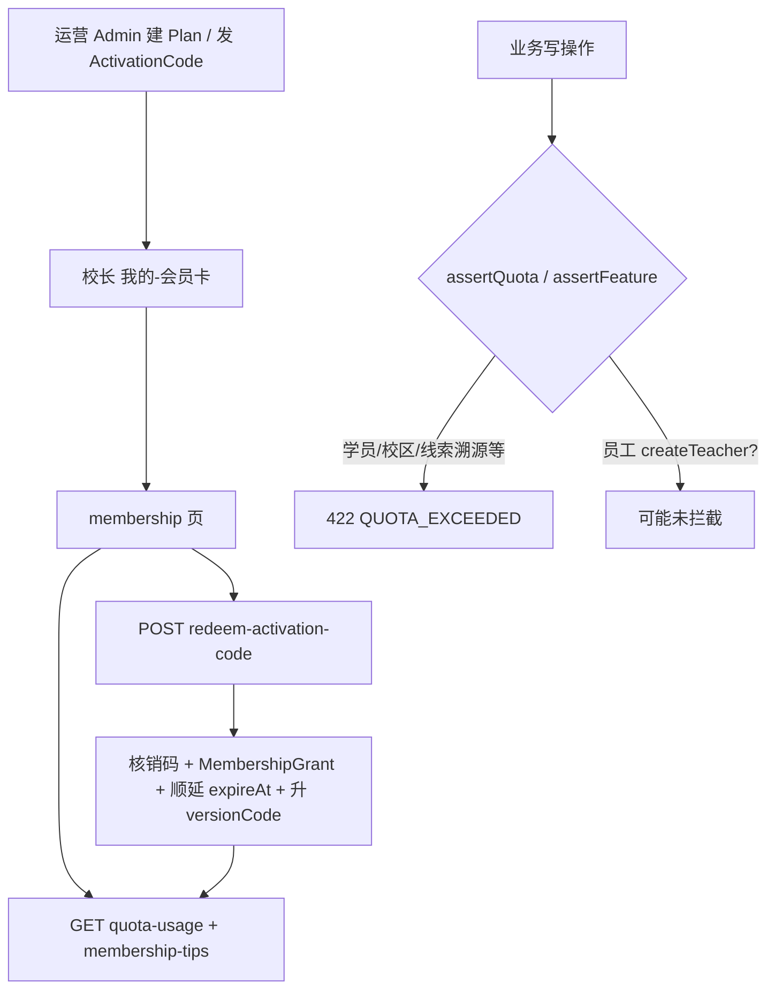

# 机构会员体系链路审计

> **日期**：2026-08-31  
> **触发**：双端修复开工前；用户刚更新会员 UI/话术相关内容  
> **备份**：`_backups/yunceTaro-backup-20260831-064639`  
> **单测**：`membership-plans` / `membership-tips` / `organization.membership` → **22 passed**

---

## 一、结论先看

| 判定 | 说明 |
|------|------|
| **主链路：基本打通** | 校长「我的」会员卡 → 会员页 → 查配额/话术 → 兑换激活码 → 后端核销顺延 `expireAt` / 升级 `versionCode` → 回写配额展示 |
| **支付：刻意不做** | 产品以「运营发激活码」为主路径（设计稿也写明），无微信支付/内购闭环 — **不算断链**，是产品选择 |
| **未完全闭环** | 到期后权益未硬降级；前端功能开关未接 entitlements；员工创建配额缺口；会员页守卫偏软 |

**总判**：会员「开通/续费展示 + 激活码兑换 + 名额硬拦截（学员/校区/部分功能）」可用；**不是**「套餐权益在全产品自动生效」的完整体系。

---

## 二、应然链路 vs 实然



| 步骤 | 应然 | 实然 | 状态 |
|------|------|------|------|
| 入口 | 仅校长/管理员见会员卡 | `profile` `isManagerRole` 才渲染 ✓ | OK |
| 会员页 | 仅 Manager | 页内软拦；**未进** `PAGE_ROLE_REQUIREMENTS` | ⚠ 深链可进空白页 |
| 读配额 | `GET /organization/quota-usage` | 生产已接；Mock 本地 storage | OK |
| 话术 | 运营覆盖 + 本地默认 | `GET membership-tips` + `mergeMembershipTips` | OK |
| 兑换 | 校长兑码开通/续费 | `redeemActivationCodeAsync` + 乐观锁核销 | OK |
| 套餐对比 UI | 展示档位差异 | `MEMBERSHIP_PLANS` 本地目录（与 BE catalog 基本对齐） | OK |
| 配额硬拦 | 超员/超员工/超校区/无功能 | 学员 `assertQuotaTx(createMember)` ✓；校区 ✓；线索 `assertFeature(leadTrace)` ✓；**teacher.create 未见 assertQuota** | ⚠ |
| 功能藏入口 | 按 entitlements 藏营销/导入等 | BE 有 `/entitlements`；**FE 零调用**；营销宫格仍全员展示 | ❌ |
| 到期处理 | 到期降权或禁止付费能力 | UI 显示已到期；**assertQuota 不看 expireAt**，versionCode 仍为付费档则权益仍在 | ❌ 隐患 |
| 超限反馈 | 引导升级 | `request.ts` 识别 `QUOTA_EXCEEDED:` 弹 Modal | OK |
| 在线支付 | — | 无（激活码模式） | 产品 OK |

---

## 三、已打通证据（路径）

| 能力 | 前端 | 后端 |
|------|------|------|
| 配额展示 | `organizationService.getQuotaUsage` → `/organization/quota-usage` | `getOrganizationQuotaUsage` + `resolveQuota` |
| 兑换 | `redeemActivationCode` → POST `/organization/redeem-activation-code` | `redeemActivationCodeAsync`（OWNER/ADMIN） |
| 话术 | `getMembershipTips` + 本地 `DEFAULT_MEMBERSHIP_TIPS` | `listMembershipTipsAsync`（Content 覆盖） |
| 学员名额 | 创建学员路径 | `student.service` → `assertQuotaTx(..., 'createMember')` |
| 校区名额 | — | `campus.service` → `createCampus` |
| 线索溯源开关 | — | `lead.service` → `assertFeature(..., 'leadTrace')` |
| 分享注册配额 | — | `auth.service` 归属时 `createEmployee` / `createMember` |
| 到期提醒待办 | — | `todo.system` 读 `expireAt` 推校长 |

---

## 四、问题清单（按严重度）

### P0 — 权益语义缺口（到期仍可能「假开通」）

**M1 · 到期不降权**  
- **现象**：`expireAt` 已过，UI 显示「已到期」，但 `versionCode` 仍是 STANDARD/FLAGSHIP；`assertQuota` / `assertFeature` **不检查** `expireAt`。  
- **影响**：会员页说到期，实际付费能力/高配额可能仍可用 → 与产品文案「部分能力暂不可用」不一致。  
- **修复**：`assertQuotaTx` / `assertFeature` 在 `expireAt < now` 时按 FREE 档解析，或强制功能关闭；另可选定时任务降 `versionCode`。

### P1 — 前端未消费权益

**M2 · `/entitlements` 前端未用**  
- 后端已提供；前端无 `getEntitlements` 调用。  
- 营销活动、批量导入、线索高级能力等仍靠写死入口，不按套餐藏。  
- **修复**：启动/我的拉取 entitlements；按 `features.*` 控制宫格与写入口。

**M3 · 会员页仅软守卫**  
- 非校长深链可进页，只看到「仅校长可查看」。  
- **修复**：`PAGE_ROLE_REQUIREMENTS` 加 Manager。

### P1 — 配额拦截不全

**M4 · 员工管理「新增教师」可能不拦配额**  
- `auth` 分享注册路径有 `createEmployee`；`teacher.service.createTeacher` **未见** `assertQuotaTx`。  
- **影响**：校长在员工管理加老师可能绕过员工名额。  
- **修复**：`createTeacher`（及恢复在职若占名额）事务内 `assertQuotaTx(..., 'createEmployee')`。

### P2 — 一致性与体验

**M5 · 套餐目录双源**  
- FE `membership-plans.ts` vs BE `organization-version.catalog` / DB `OrganizationVersion`。当前数字大致对齐，运营改库后 FE 对比表可能漂移。  
- **建议**：对比表改为读 BE 版本列表，或构建时同步。

**M6 · features 形状不一致**  
- FE `OrganizationQuotaUsage.features` 类型偏窄（leadTrace / batchImportExport）；BE 已有 marketing / multiCampus / classBooking 等。  
- **建议**：对齐类型并用完整 map。

**M7 · 兑换成功引导**  
- 超限 Modal 只说「联系运营」，会员页才有兑码；可在 Modal 增加「去兑换激活码」跳转。

---

## 五、路径冒烟（建议真机/联调）

```
校长账号
  1. 我的 → 会员卡 → 进 membership（看配额条、生命周期文案）
  2. action=redeem 深链 → 自动打开兑码弹层
  3. 无效码 / 已用码 → 明确错误
  4. 有效码 → expireAt 顺延、versionName 更新、回我的卡片同步
  5. 学员加到上限 → 422 + 升级弹窗
  6.（测 M4）员工加到上限 → 应拦截；若能加上则确认 M4
  7. 人为改 expireAt 到过去 → UI 已到期；再测线索/高配额是否仍可用（验 M1）

教师/家长
  8. 我的无会员卡
  9. 深链 membership → 应无权限或提示（现为软拦）
```

---

## 六、对双端修复计划的影响

| 原计划项 | 与会员关系 | 建议 |
|----------|------------|------|
| 教师营销四入口（T-B3） | 应用 `features.marketing` | 有权益才展示；无则藏（比「一律藏」更准） |
| 四格真实数据 | 无关会员 | 仍按「接真数据」做 |
| 场地/私教真实落库 | 无关会员 | 按已确认决策做 |
| 教师表单完整落库 | 新增员工占配额 | 与 **M4** 一起修 |

**建议插入 Sprint 0.5（会员止血，可与 Sprint 0 并行）**  
1. M3 会员页 Manager 守卫  
2. M4 createTeacher 配额  
3. M1 到期降权策略（至少 assert 读 expireAt）  
4. M2 前端接 entitlements（至少藏营销/导入）

---

## 七、验证记录（本次）

- 前端单测：22 passed（plans / tips / organization.membership）  
- 代码静态走查：见上文路径表  
- 真机兑码 / 到期硬拦：**未跑**（需联调环境 + 运营码）
