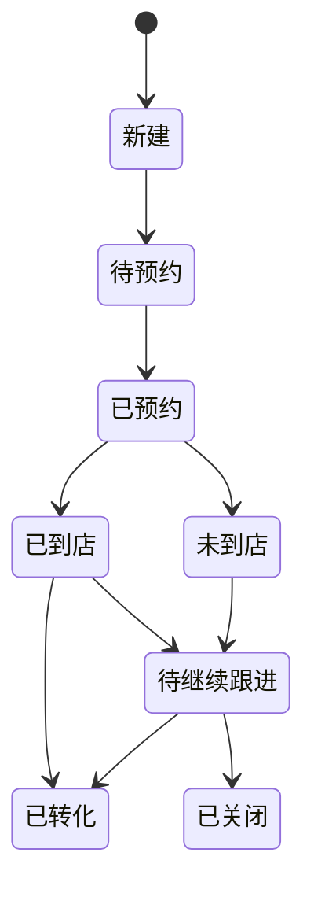
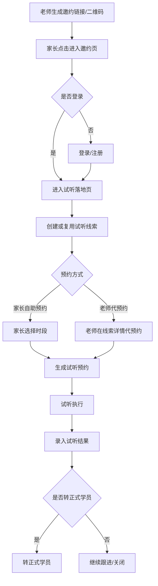

# 云策教务 PRD

## 1. 文档信息

| 项目 | 内容 |
|---|---|
| 文档名称 | 试听线索邀约与预约闭环 PRD |
| 产品阶段 | 开发阶段 |
| 文档状态 | 已更新待评审 |
| 适用端 | 教师端、家长端、校长/教务管理端 |
| 关联交付 | `docs/UI-design/lead-trial-booking/lead-trial-booking-flow.html` |
| 待确认项 | 后端表结构上线节奏、邀约二维码是否需要“永久码 + 渠道码”双模式 |

---

## 2. 背景与目标

### 2.1 背景

当前系统已经具备学员、课程预约、家长登录、学生邀请码绑定等能力，但缺少“试听线索”这一层业务对象，导致以下问题：

1. 老师无法通过分享课程链接或二维码，把潜在家长沉淀为自己的试听线索。
2. 家长进入后只能走“正式学员绑定/预约”思路，无法自然承接试听场景。
3. 老师手动录入试听意向后，缺少统一的跟进、预约、结果记录与转化链路。
4. 邀请老师与业绩归属关系无法被系统稳定记录，后续统计与结算容易产生争议。

### 2.2 业务目标

构建一条从“老师发起邀约”到“家长预约试听”再到“试听结果沉淀与转正式学员”的完整闭环，支持两种来源：

1. 老师分享课程给家长，家长进入后自动落线索。
2. 老师手动录入线索并代家长预约。

### 2.3 成功指标

| 指标 | 定义 | 目标 |
|---|---|---|
| 邀请落线索成功率 | 进入邀约页并成功创建试听线索的比例 | >= 95% |
| 线索预约转化率 | 已建线索中完成试听预约的比例 | [待验证] |
| 试听到店率 | 已预约试听中实际到店的比例 | [待验证] |
| 试听转正率 | 已到店试听中转为正式学员的比例 | [待验证] |
| 邀请归属完整率 | 所有试听线索中存在邀请老师归属的比例 | 100% |

---

## 3. 核心结论

1. 本功能必须新增独立的`试听线索 Lead`模型，不能直接复用正式`Student`模型。
2. 每一条试听线索必须生成一个可用于预约与记录的`trial_student_id`，作为短信能力缺失阶段的主索引。
3. 老师分享入口必须收敛为单独的“我的邀约”页面，页面内只放二维码、链接、复制和转发，不在其他页面放置邀约入口。
4. 家长点击后先完成注册，再直接进入约课页面；家长可查看全部可预约课程与科目。
5. 邀请老师只在试听阶段形成弱绑定，最终业绩归属以“首次有效预约成功时的最近有效邀约老师”为自动锁定依据。
6. 学员管理页面应改造为 `学员 / 线索` 双 Tab 管理，老师只能看到自己的线索，且两个 Tab 分别展示各自统计口径。
7. 线索详情页必须承接快捷预约、快捷充值、跟进记录，不再拆过多独立页面；充值直接复用现有课包充值链路。
8. 家长账号本期支持维护多个试听孩子，以满足多孩子家庭场景；线索需增加“昵称”字段辅助区分重名孩子。

---

## 3.1 行业标准业务分层与产品原则

### 3.1.1 行业标准业务分层

试听业务在教培行业中属于“招生转化链路”，而不是正式教务链路。按照行业标准，应拆分为以下四层：

| 层级 | 核心对象 | 业务目标 | 设计要求 |
|---|---|---|---|
| 招生层 | Lead | 承接流量、记录来源、锁定归属 | 必须独立 |
| 预约层 | LeadBooking | 安排试听时段、老师、校区、课程 | 必须独立 |
| 跟进层 | LeadConversion / FollowUp | 沉淀试听结果与转化意向 | 必须独立 |
| 教务层 | Student | 正式分班、课包、消课、请假、排课 | 仅转化后进入 |

### 3.1.2 产品设计原则

1. `线索先独立，预约再承接，转化后入正式学员`
2. `流量入口统一，归属关系延迟锁定`
3. `家长自助预约与老师代预约共用一套预约池`
4. `试听前弱绑定，转化后正式绑定`
5. `先解决 MVP 招生闭环，不提前引入复杂 CRM`

### 3.1.3 本期产品边界判断

1. 试听对象不是正式学员，不进入正式教务统计口径。
2. 试听阶段的主索引使用`trial_student_id + child_name`。
3. 家长可在试听阶段完成账号登录，但不要求立即绑定正式学员关系。
4. 家长一个账号下可同时关联多个试听孩子。
5. 正式家长绑定动作优先放在“转正式学员”后进行。

---

## 4. 角色与对象定义

### 4.1 角色

| 角色 | 核心任务 |
|---|---|
| 老师 | 发起分享、查看线索、手动录入、代预约、跟进结果 |
| 家长 | 通过邀约链接进入、登录/注册、预约试听、查看试听记录 |
| 校长/教务 | 查看全校区试听线索、处理归属争议、配置规则 |

### 4.2 核心对象

| 对象 | 定义 | 说明 |
|---|---|---|
| Lead | 试听线索 | 未转正式学员前的潜在客户对象 |
| trial_student_id | 临时学员 ID | 用于预约、试听记录、结果跟进 |
| LeadBooking | 试听预约 | 家长自助预约或老师代预约产生 |
| LeadConversion | 转化记录 | 试听后转正式学员、未转化、继续跟进等结果 |
| InvitePage | 老师邀约页 | 课程、老师、校区、预约入口聚合页 |

### 4.3 Lead 与 Student 的边界

| 维度 | Lead | Student |
|---|---|---|
| 阶段 | 试听前/试听中 | 已正式建档 |
| 归属 | 邀请老师/跟进老师 | 正式授课老师/班级 |
| 课时 | 试听次数/试听资格 | 正式课包与消课 |
| 绑定关系 | 可弱绑定家长 | 正式家长绑定 |
| 转换方式 | 可转 Student | 不可回退为 Lead |

### 4.4 家长关系边界

| 阶段 | 家长关系 | 说明 |
|---|---|---|
| 邀约进入 | 匿名访问 | 仅记录来源，不强制建档 |
| 登录后落线索 | 弱绑定 | 与 Lead 关联，可查看试听记录 |
| 试听预约成功 | 弱绑定增强 | 可同步预约、通知、跟进状态 |
| 转正式学员后 | 正式绑定 | 进入正式学员 - 家长关系体系 |

### 4.5 归属角色定义

| 角色字段 | 含义 | 是否可修改 |
|---|---|---|
| first_invite_teacher_id | 首次有效邀约老师 | 仅校长/教务可改 |
| latest_invite_teacher_id | 最近一次有效邀约老师 | 系统自动更新 |
| booking_teacher_id | 首次有效预约对应老师 | 首次预约后自动确定 |
| owner_teacher_id | 当前成单归属老师 | 锁定前系统可更新，锁定后仅校长/教务可改 |
| creator_teacher_id | 建档老师 / 手动录入老师 | 自动记录 |
| operator_id | 本次操作执行人 | 自动记录 |

---

## 5. 需求范围

### 5.1 P0 范围

1. 老师拥有单独的邀约页，页内展示专属二维码、链接、复制、转发
2. 家长点击后注册并进入约课页面
3. 家长查看全量可预约课程与科目后完成试听预约
4. 老师手动录入试听线索
5. 老师代家长预约试听
6. 学员管理页增加 `学员 / 线索` 双 Tab
7. 试听线索列表、详情、状态流转
8. 线索详情快捷充值
9. 试听结果记录
10. 试听线索转正式学员
11. 基础重复线索识别与提醒
12. 弱绑定归属、首次有效预约锁定、归属变更权限控制
13. 家长账号支持多个试听孩子管理

### 5.2 P1 范围

1. 重复线索智能合并
2. 线索跟进提醒与超时预警
3. 试听转化经营报表
4. 试听经营报表细化

### 5.3 本期不做

1. 手机短信验证码登录
2. 外部 CRM 打通
3. 自动分配线索给其他老师
4. 基于 AI 的转化建议

---

## 6. 用户场景

### 场景 A：老师分享专属邀约页，家长注册后约课

1. 老师进入“我的邀约”页面
2. 页面居中展示老师专属二维码，下方展示专属链接、复制链接、转发邀请卡片
3. 家长扫码或点击链接后先完成注册
4. 系统写入访客来源，自动创建或复用试听线索
5. 家长注册完成后直接进入约课页面
6. 家长查看全部可预约课程与科目
7. 家长选择任意课程的可预约试听时段并提交
8. 系统生成试听预约记录，并把线索状态更新为“已预约”，同时自动锁定成单归属老师

### 场景 B：老师手动录入线索并代预约

1. 老师进入“试听线索”列表点击“新增线索”
2. 输入孩子姓名，手机号选填，科目/课程必填
3. 系统生成试听线索与`trial_student_id`
4. 老师在详情页点击“代预约试听”
5. 选择可预约时段，完成预约
6. 试听结束后录入结果：到店、未到、待跟进、已转化

### 场景 C：试听后转正式学员

1. 老师在线索详情点击“转正式学员”
2. 选择“新建正式学员”或“合并到已有学员”
3. 系统复制基础资料并保留试听历史
4. 线索状态变为“已转正式学员”

---

## 7. 功能方案

### 7.1 教师端：我的邀约页面

#### 目标

让老师在唯一固定入口完成全部邀约动作，并把所有来源流量先收口到自己的邀约池。

#### 功能点

| 功能点 | 描述 | 优先级 |
|---|---|---|
| 我的邀约页面入口 | 老师进入专属邀约页 | P0 |
| 专属邀约二维码 | 页面主视觉，支持长期使用 | P0 |
| 专属邀约链接 | 页面展示完整链接 | P0 |
| 复制链接按钮 | 一键复制专属链接 | P0 |
| 转发邀请卡片 | 直接发给家长 | P0 |
| 基础成效数据 | 展示访问次数、落线索数、预约数 | P1 |

#### 关键规则

1. 邀约链接必须携带`teacher_id`，可选携带`campus_id`、`channel`。
2. 邀约页面必须是老师唯一官方分享入口，其他页面不再放置邀约入口。
3. 页面布局固定为：二维码居中 -> 链接展示 -> `复制链接` -> `转发邀请卡片`。
4. 同一老师多次分享给同一家长，优先复用最近一次未失效邀约关系。

### 7.2 家长端：邀约落地页

#### 目标

把原先“裸链接跳登录”的链路，改造成可以承接试听兴趣的落地页。

#### 页面内容

1. 注册承接说明
2. 当前校区可预约课程与科目列表
3. 试听说明与校区信息
4. 登录/注册引导
5. 已预约状态展示

#### 关键规则

1. 家长进入后优先完成注册，再进入约课页面。
2. 注册成功后自动创建或复用试听线索。
3. 家长可预约任意课程和科目，不受邀请老师原始科目限制。
4. 首次有效预约成功前，仅更新最近有效邀约老师，不锁定最终归属。

### 7.3 线索自动创建

#### 触发时机

1. 家长在邀约页完成登录/注册后
2. 老师手动新增试听线索后

#### 创建字段

| 字段 | 说明 |
|---|---|
| lead_id | 线索 ID |
| trial_student_id | 临时学员 ID |
| child_name | 孩子姓名 |
| parent_name | 家长姓名 |
| parent_phone | 家长手机号，选填 |
| child_nickname | 孩子昵称 / 区分称呼，选填 |
| first_invite_teacher_id | 首次有效邀约老师 |
| latest_invite_teacher_id | 最近一次有效邀约老师 |
| booking_teacher_id | 首次有效预约对应老师 |
| owner_teacher_id | 当前成单归属老师，锁定前可变 |
| creator_teacher_id | 建档老师 |
| source_type | 分享链接 / 二维码 / 手动录入 |
| source_course_id | 默认展示课程，非最终预约课程锁定字段 |
| booking_course_id | 实际预约课程 |
| campus_id | 归属校区 |
| owner_lock_status | weak / locked |
| owner_lock_reason | first_booking / manual_adjust |
| status | 新建 / 待预约 / 已预约 / 已到店 / 未到店 / 已转化 / 已关闭 |

#### 去重规则

1. 优先用`parent_user_id + child_name + campus_id`判重；若存在昵称，则把`child_nickname`作为辅助识别字段。
2. 无家长账号时，用`child_name + parent_phone + campus_id`尝试判重。
3. 无手机号时，用`child_name + 最近 30 天 + campus_id`做“疑似重复”提醒。
4. 命中明确重复或疑似重复时，系统只弹出“疑似重复”提示，展示已有线索的孩子姓名、昵称、家长手机号、最近跟进时间。
5. 系统不提供合并或分流选择，由老师自行返回列表处理。
6. 老师如判断当前为误建或重复数据，可手动删除当前线索；删除前必须二次确认。
7. 不强制复用，因为存在孩子重名场景。
8. 命中重复线索但尚未锁定归属时，可更新`latest_invite_teacher_id`，不自动更新`owner_teacher_id`。

#### 去重规则设计目的

1. 防止正式转化率虚高
2. 防止同一线索被多次抢占归属
3. 保障试听经营漏斗统计准确

### 7.4 学员管理页：学员 / 线索双 Tab

#### 能力说明

在现有学员管理页中新增 `线索` Tab，与 `学员` Tab 并列管理。

#### 关键规则

1. `学员` Tab 继续展示正式学员，并展示正式学员统计口径。
2. `线索` Tab 只展示当前老师自己的线索，不展示其他老师线索，并展示线索统计口径。
3. `线索` Tab 卡片字段至少包括：孩子姓名、昵称、家长信息、归属状态、预约状态、最近跟进时间。
4. 老师点击线索卡片进入线索详情页。

### 7.5 教师端：试听线索列表

#### 列表维度

1. 全部线索
2. 待预约
3. 已预约
4. 今日试听
5. 待跟进
6. 已转化

#### 筛选项

1. 校区
2. 科目
3. 邀请老师
4. 线索来源
5. 时间区间

#### 搜索项

1. 孩子姓名
2. 家长手机号
3. `trial_student_id`

### 7.6 教师端：手动录入线索

#### 必填项

1. 孩子姓名
2. 意向课程/科目
3. 校区

#### 选填项

1. 孩子昵称 / 区分称呼
2. 家长姓名
3. 家长手机号
4. 年龄/年级
5. 渠道备注
6. 跟进备注

#### 关键规则

1. 孩子姓名是主索引字段，不能为空。
2. 手机号不是强依赖，避免被短信能力阻塞。
3. 保存后立即生成`trial_student_id`。

### 7.7 家长端：自助预约试听

#### 能力说明

家长在邀约页或预约页中选择任意课程的具体试听时段，系统创建试听预约。

#### 关键规则

1. 家长可查看当前校区全部可预约课程与科目，不限制为邀请老师原始科目。
2. 同一条线索同一时段不可重复预约。
3. 超出容量时根据校区规则进入候补或直接失败。
4. 首次有效预约成功后，系统写入`booking_teacher_id = latest_invite_teacher_id`，并同步锁定`owner_teacher_id`。
5. 预约记录中必须保留`lead_id`、`trial_student_id`、`booking_course_id`。

### 7.8 教师端：代家长预约试听

#### 能力说明

老师可以在线索详情直接代约试听，适用于电话沟通或线下到店场景。

#### 关键规则

1. 代预约与家长自助预约使用同一套排期与名额规则。
2. 代预约后自动记录操作人为老师。
3. 如果家长后续登录，应能看到这条试听预约记录。

### 7.9 线索详情快捷动作

#### 必备动作

1. 快捷预约
2. 快捷充值
3. 记录跟进详情

#### 关键规则

1. 快捷预约进入统一约课逻辑。
2. 快捷充值直接复用现有正式课包充值链路，但必须保留当前线索来源与归属关系。
3. 跟进详情必须沉淀时间、动作、备注、操作人。

### 7.10 试听结果与跟进

#### 结果状态

| 状态 | 说明 |
|---|---|
| 已到店 | 实际完成试听 |
| 未到店 | 已预约未到 |
| 待继续跟进 | 试听后未立即成交 |
| 已转化 | 已转正式学员 |
| 已关闭 | 明确放弃 |

#### 附加记录

1. 试听反馈
2. 家长意向等级
3. 下次跟进时间
4. 负责人备注

#### 跟进动作标准化

| 动作 | 说明 |
|---|---|
| 电话回访 | 试听后 24 小时内跟进 |
| 微信追踪 | 适用于未留手机号但已加老师微信 |
| 再次邀约 | 适用于未到店或试听后需补试听 |
| 转化推进 | 引导转正式学员、购买课包、安排分班 |

### 7.11 转正式学员

#### 转化方式

1. 新建正式学员
2. 合并到已有正式学员

#### 数据继承规则

| 数据 | 是否继承 |
|---|---|
| 孩子姓名 | 是 |
| 家长信息 | 是 |
| 试听记录 | 是，保留来源 |
| 邀请老师归属 | 是 |
| 试听备注 | 是 |
| 正式课包 | 否，需要单独创建 |

#### 转化规则

1. Lead 转 Student 时，不删除 Lead，仅将 Lead 状态改为`已转化`。
2. 转化后保留：
   - 来源课程
   - 邀请老师
   - 首次触达时间
   - 首次预约时间
   - 全部试听记录
3. 正式课包、分班、消课、请假等教务行为从 Student 层重新开始。
4. 如已存在正式学员，允许“合并到已有学员”，但必须保留此次试听来源链路。
5. 转化动作必须写入`LeadConversion`并记录操作人、时间、备注。

#### 不允许的转化做法

1. 不允许直接把 Lead 改名成 Student 替代转换。
2. 不允许删除试听历史后再新建正式学员。
3. 不允许在普通老师权限下修改邀请归属后再转化。

---

## 8. 状态机

### 8.1 Lead 状态机



### 8.2 预约主流程



---

## 9. 页面清单

| 页面 | 用户 | 目标 | 是否新增 |
|---|---|---|---|
| 我的邀约页 | 老师 | 展示二维码、链接、复制、转发 | 新增 |
| 家长注册承接页 | 家长 | 完成注册并进入约课 | 新增 |
| 约课页 | 家长/老师 | 查看课程并选择时段 | 复用扩展 |
| 学员管理页 | 老师 | 通过 Tab 管理学员与线索 | 改造 |
| 线索详情页 | 老师 | 快捷预约、充值、跟进、记录结果 | 新增 |
| 手动新增线索页 | 老师 | 快速录入线索 | 新增 |
| 试听结果页 | 老师 | 记录结果与转化动作 | 新增 |

---

## 10. 信息架构

```text
教师端
  我的邀约
    专属二维码
    专属链接
    复制链接
    转发邀请卡片
  学员管理
    学员 Tab
    线索 Tab
      线索列表
      线索详情
        快捷预约
        快捷充值
        跟进详情
        记录试听结果
        转正式学员
      新增线索

家长端
  注册承接
    注册
    进入约课页
  约课页
    选择课程
    选择时段
  我的试听
    预约详情
```

---

## 11. 数据模型建议

### 11.1 Lead

| 字段 | 类型 | 说明 |
|---|---|---|
| id | string | 主键 |
| trial_student_id | string | 临时学员 ID |
| child_name | string | 孩子姓名 |
| child_nickname | string | 孩子昵称 / 区分称呼 |
| child_gender | string | 选填 |
| child_age | string | 选填 |
| parent_user_id | string | 家长账号 ID，未登录时为空 |
| parent_name | string | 家长姓名 |
| parent_phone | string | 家长手机号 |
| first_invite_teacher_id | string | 首次有效邀约老师 |
| latest_invite_teacher_id | string | 最近一次有效邀约老师 |
| booking_teacher_id | string | 首次有效预约对应老师 |
| owner_teacher_id | string | 当前成单归属老师 |
| creator_teacher_id | string | 建档老师 |
| campus_id | string | 校区 |
| source_type | string | share_link / qr / manual |
| source_course_id | string | 默认展示课程 |
| booking_course_id | string | 实际预约课程 |
| source_channel | string | 渠道标记 |
| owner_lock_status | string | weak / locked |
| owner_lock_reason | string | first_booking / manual_adjust |
| status | string | 线索状态 |
| first_touch_at | datetime | 首次触达时间 |
| booked_at | datetime | 首次预约时间 |
| converted_at | datetime | 转化时间 |
| closed_reason | string | 关闭原因 |
| notes | string | 备注 |
| duplicate_hint | boolean | 是否命中疑似重复 |
| weak_bind_parent | boolean | 是否为试听阶段弱绑定家长 |

### 11.2 LeadBooking

| 字段 | 类型 | 说明 |
|---|---|---|
| id | string | 主键 |
| lead_id | string | 关联线索 |
| trial_student_id | string | 临时学员 ID |
| booking_type | string | self / teacher_assist |
| course_id | string | 预约课程 |
| schedule_id | string | 时段 |
| teacher_id | string | 授课老师 |
| campus_id | string | 校区 |
| status | string | booked / waitlist / cancelled / completed / expired |
| operator_id | string | 操作人 |
| created_at | datetime | 创建时间 |
| source_from | string | self / teacher_assist / imported |

### 11.3 LeadConversion

| 字段 | 类型 | 说明 |
|---|---|---|
| id | string | 主键 |
| lead_id | string | 关联线索 |
| result_type | string | arrived / no_show / follow_up / converted / closed |
| result_note | string | 结果备注 |
| next_follow_time | datetime | 下次跟进时间 |
| target_student_id | string | 转正式学员后的正式 ID |
| operator_id | string | 操作人 |
| created_at | datetime | 创建时间 |

### 11.4 推荐补充模型

| 模型 | 作用 |
|---|---|
| LeadTouchLog | 记录每次分享、点击、扫码、触达 |
| LeadFollowUp | 记录每次跟进动作和沟通纪要 |
| LeadOwnershipLog | 记录归属调整、负责人调整的审计日志 |

---

## 12. 归属与权限规则

### 12.1 业绩归属

1. `first_invite_teacher_id`在首次有效邀约时生成，仅用于保留首触达来源，不直接决定成单归属。
2. `latest_invite_teacher_id`在归属未锁定前可被新的有效邀约覆盖。
3. `owner_teacher_id`默认处于弱绑定状态，首次有效预约成功时自动锁定为`latest_invite_teacher_id`。
4. `booking_teacher_id`用于记录首次有效预约对应老师，作为提成与归属判定主依据。
5. 归属锁定后，后续其他老师链接进入只记录触点，不自动修改`owner_teacher_id`。
6. 归属修改必须记录到`LeadOwnershipLog`，包含原归属、新归属、操作人、原因。
7. 老师只能看到自己的线索和自己代预约的记录，不能跨老师篡改归属。

### 12.2 归属冲突处理规则

| 场景 | 处理规则 |
|---|---|
| 同一老师重复分享同一孩子 | 复用已有 Lead，刷新 latest_invite，不新增归属 |
| 不同老师先后触达同一孩子，且均未预约 | 允许 latest_invite 被后者覆盖，归属仍不锁定 |
| 老师 A 先邀约未预约，老师 B 后邀约并完成首次预约 | owner 自动锁定为老师 B，老师 A 保留 first_invite |
| 教务转交线索给其他老师 | 锁定前可改 owner，锁定后仅管理员可人工调整 |
| 确认归属录入错误 | 仅校长/教务可调整，并留痕 |

### 12.3 权限

| 功能 | 老师 | 校长/教务 | 家长 |
|---|---|---|---|
| 生成邀约链接 | ✅ | ✅ | — |
| 查看本人线索 | ✅ | ✅ | — |
| 查看全校区线索 | — | ✅ | — |
| 新增线索 | ✅ | ✅ | — |
| 代预约试听 | ✅ | ✅ | — |
| 记录试听结果 | ✅ | ✅ | — |
| 调整归属 | — | ✅ | — |
| 自助预约试听 | — | — | ✅ |
| 删除误建重复线索 | ✅ | ✅ | — |
| 转正式学员 | ✅ | ✅ | — |

---

## 13. 异常与边界处理

| 场景 | 处理方案 |
|---|---|
| 家长重复进入同一邀约链接 | 复用原 Lead，刷新最近访问时间和 latest_invite |
| 家长已存在多个孩子 | 本期支持一个家长账号维护多个试听孩子，预约时先选择当前试听孩子 |
| 老师手动录入时只有孩子名，没有手机号 | 允许保存，生成 `trial_student_id` |
| 同一孩子已是正式学员 | 提示“疑似已建档”，允许转到已有学员或继续创建线索 |
| 同一孩子重复录入 | 命中去重规则后提示“疑似重复”，由老师自行判断是否删除误建线索；删除前需二次确认，删除线索但不删除操作日志 |
| 试听预约超出人数 | 按校区预约规则进入候补或提示失败 |
| 家长未登录就离开 | 保存匿名访问记录，不强制落地 Lead |
| 邀约链接失效 | 展示兜底页，可返回课程列表或联系老师 |
| 试听后未成交 | 状态进入“待继续跟进”，不直接关闭 |
| 已转正式学员后再次收到邀约 | 默认识别为已建档，记录触点但不自动改归属 |

---

## 14. 埋点建议

| 事件 | 触发时机 |
|---|---|
| invite_page_view | 家长进入邀约落地页 |
| invite_login_success | 家长在邀约上下文登录成功 |
| lead_created | 成功创建试听线索 |
| lead_reused | 命中重复线索并复用 |
| lead_manual_created | 老师手动新增线索 |
| trial_booking_submit | 提交试听预约 |
| trial_booking_success | 试听预约成功 |
| trial_booking_assisted | 老师代预约成功 |
| trial_result_submit | 老师提交试听结果 |
| lead_converted | 线索转正式学员 |

---

## 15. 排期建议

### 15.1 MVP 拆分

| 阶段 | 内容 | 优先级 |
|---|---|---|
| 第 1 阶段 | 数据模型、邀约链接、家长落地页、自动建线索 | P0 |
| 第 2 阶段 | 家长自助预约、老师代预约、线索列表详情 | P0 |
| 第 3 阶段 | 试听结果、转正式学员、基础归属与去重规则 | P0 |
| 第 4 阶段 | 去重合并、经营看板、提醒机制 | P1 |

### 15.2 里程碑

| 里程碑 | 交付物 | 验收标准 |
|---|---|---|
| M1 | PRD + 交互稿 | 产品、研发、设计评审通过 |
| M2 | API 与数据表评审 | 后端确认数据模型与状态机 |
| M3 | 前端原型联调 | 从邀约进入到预约成功可走通 |
| M4 | 结果闭环 | 试听结果与转正式学员可操作 |

---

## 16. 待确认问题

1. 邀约二维码是否需要“永久码 + 渠道码”双模式？[待验证]
2. 当前校区下“全部可预约课程”是否包含跨学段课程，还是仅展示家长所在年龄段适配课程？[待验证]
3. 校长/教务是否需要跨老师二次分配线索？[待验证]
4. 管理端是否需要补一页“重复线索处理台”用于后续批量治理？[待验证]
5. 后端表结构上线是否与现有预约链路同版本发布？[待验证]

---

## 17. 关联交付说明

本 PRD 对应的静态交互稿位于：

`docs/UI-design/lead-trial-booking/lead-trial-booking-flow.html`

交互稿覆盖以下环节：

1. 老师预约入口
2. 分享与二维码
3. 家长邀约落地页
4. 登录/注册承接
5. 家长预约试听
6. 老师手动录入与代预约
7. 试听结果记录
8. 转正式学员闭环
